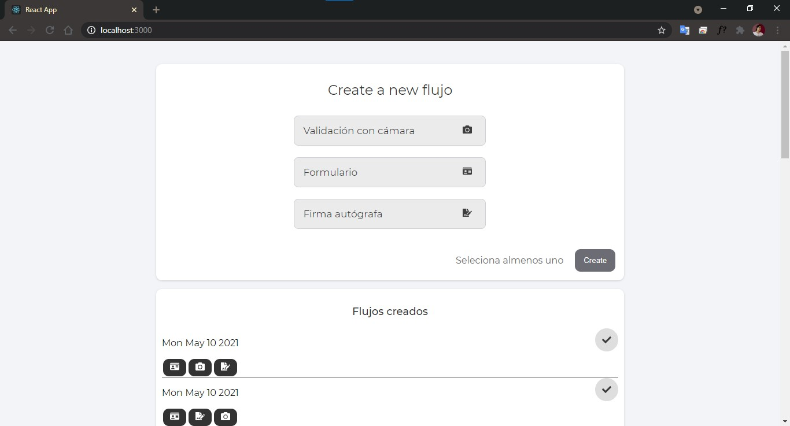
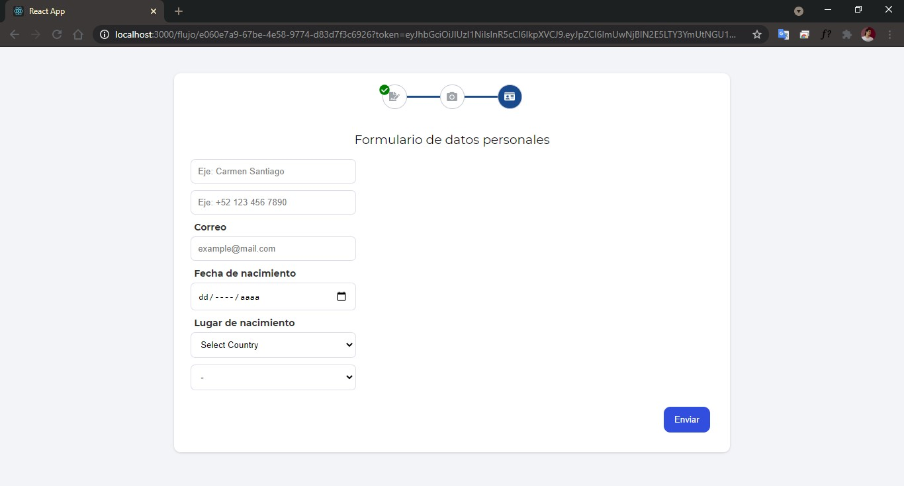

# Rem Tools

[DEMO](ttps://remtools.vercel.app/)





# Demo

https://remtools.vercel.app/

# Run
[Only development]

### Backend

```bash
$ cd backend
$ npm run start:dev
```

### Frontend

```bash
$ cd client
$ npm start
```

# Diagrams
Sequence diagram. Request flow of creating and resolving a "flujo".


Types definition


